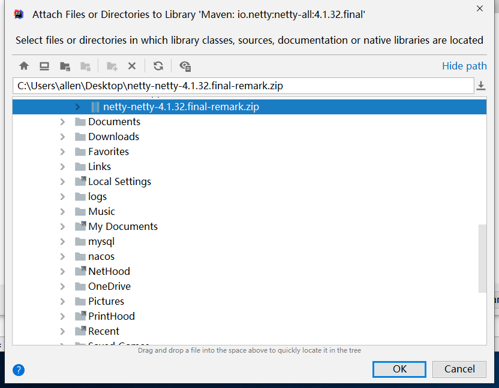

# 专题一用到的项目源码
有问题，提issue
## git pull出现问题的时候，不用多想，删除本地项目，重新git clone

## Netty的源码注释版本
https://github.com/crazyFeng/netty/tree/netty-4.1.32.final-remark 

----------

## idea中导入带注释的netty源码
### 1. 查看专题一下是否已经存在 netty-netty-4.1.32.final-remark.zip 文件。（没有：更新git）

### 2. 导入工程代码到idea

### 3. 为工程导入源码

